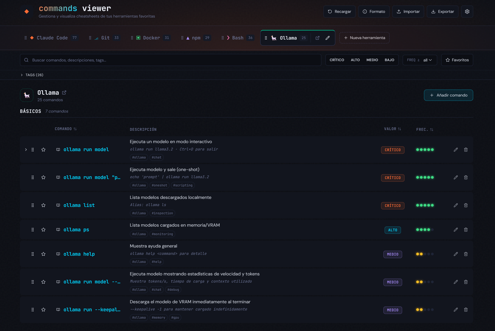
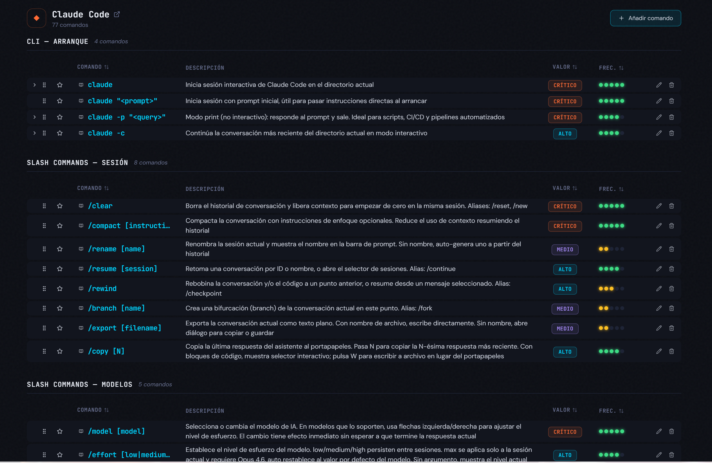
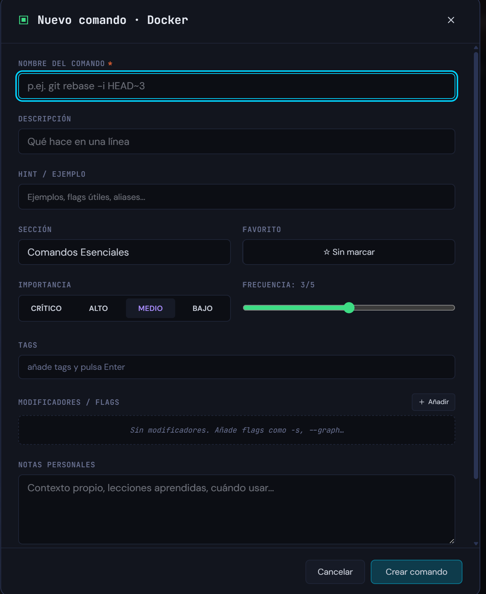

[English](README.md) | [Español](README.es.md)

# Commands Viewer

Your local panel for turning scattered commands into a useful, searchable,
editable library.

`Commands Viewer` is a local app for storing CLI cheatsheets with a practical
interface: commands, examples, flags, tags, favorites, notes, and manual
 ordering by tool. The goal is not just to collect snippets, but to keep a
living reference you can actually browse, refine, and maintain over time.




### Compact Mode




### New Command




## What It Is

Think of it as a mix of:

- a personal terminal cheatsheet,
- a small editable catalog of real commands,
- and a local UI so you do not have to rely on scattered notes or random
  Markdown files.

Everything runs locally. No accounts, no cloud sync, no telemetry.
Your data lives in [`data/commands.json`](data/commands.json).

## Highlights

- **170+ seeded commands** across several tools, including a broad Claude Code,
  Git, Docker, npm, Bash, and Ollama base.
- **Real global search**, including modifiers and flags inside each command.
- **Full editing flow** for tools, commands, tags, notes, favorites, and
  examples directly from the UI.
- **Expandable modifier rows**, useful when a command has flags worth keeping
  properly documented.
- **Manual drag & drop ordering** for both tool tabs and command lists.
- **Persistent filters** for favorites, minimum frequency, tags, and
  importance.
- **JSON import / export** with preview and warnings before merging data.
- **Real disk persistence** through an Express API that writes to
  `commands.json` atomically.

## Why It Exists

Useful commands usually end up split across shell history, gists, quick notes,
old READMEs, or half-memory. That works for a while. Then it stops scaling.

`Commands Viewer` is meant to solve exactly that:

- centralize your frequent commands,
- add the context that makes them reusable,
- filter them quickly,
- and keep them maintained without leaving the project.

## Stack

- **Frontend**: Vite 8 + React 19 + TypeScript + Tailwind CSS v4
- **State**: Zustand
- **Drag & drop**: dnd-kit
- **Icons**: lucide-react
- **Local backend**: Express 5 running on `tsx`
- **Persistence**: flat JSON with atomic writes and Windows-safe handling

## Requirements

- Node.js **20** or higher
- npm **10** or higher

## Getting Started

```bash
npm install
npm run dev
```

This starts two processes in parallel:

- **API** at `http://localhost:3001`
- **UI** at `http://localhost:5173`

Open the Vite URL. The frontend proxies `/api/*` to the backend, so you do not
need any extra setup to begin using it.

## Scripts

| Script | What it does |
|---|---|
| `npm run dev` | Starts API + UI in parallel with hot reload |
| `npm run server` | Runs only the Express backend in watch mode |
| `npm run build` | Type-check + production build into `dist/` |
| `npm run preview` | Serves the production build locally |
| `npm run lint` | Runs ESLint |

## What You Can Do

### Explore

- browse tools in reorderable tabs,
- sort by name, importance, or frequency,
- expand modifiers to inspect flags and examples,
- search through both commands and nested rows.

### Curate Your Library

- create and edit tools,
- add commands with description, hint, notes, and tags,
- mark favorites,
- tune frequency and importance,
- manually reorder lists.

### Move Data Safely

- export your collection to JSON,
- import from an external file,
- inspect a preview before applying changes,
- catch warnings such as duplicated slugs or orphan commands.

## Data Model

```ts
interface Tool {
  id: string;
  name: string;
  slug: string;
  icon: string;
  color: string;
  order: number;
}

interface Modifier {
  flag: string;
  description: string;
  example?: string;
}

interface Command {
  id: string;
  toolId: string;
  section: string;
  name: string;
  description: string;
  hint: string;
  importance: "critical" | "high" | "medium" | "low";
  frequency: number;
  tags: string[];
  notes: string;
  favorite: boolean;
  order: number;
  modifiers: Modifier[];
}
```

The full importable JSON format is documented inside the app itself through the
**Format** button in the header.

## Project Structure

```text
Commands-Viewer/
├── data/
│   └── commands.json
├── server/
│   └── index.ts
├── src/
│   ├── components/
│   ├── lib/
│   ├── store/
│   ├── types/
│   ├── App.tsx
│   ├── main.tsx
│   └── index.css
├── index.html
├── package.json
├── tsconfig.json
└── vite.config.ts
```

## Accessibility and UX

- keyboard-friendly navigation,
- focus trap inside modals,
- `aria-*` support on key interactions,
- visible focus ring when it matters,
- configurable density with compact and comfortable modes.

## Philosophy

- **Local-first**: your data stays yours.
- **Useful simplicity**: flat JSON before unnecessary infrastructure.
- **Fast editing**: less friction, more real maintenance.
- **Reliable persistence**: atomic saves so your library stays safe.

## License

MIT © [luisgele](https://github.com/luisgele)

See [LICENSE](LICENSE) for the full text.

## Credits

Personal project by [luisgele](https://github.com/luisgele), built with
Claude Code as a development copilot.
